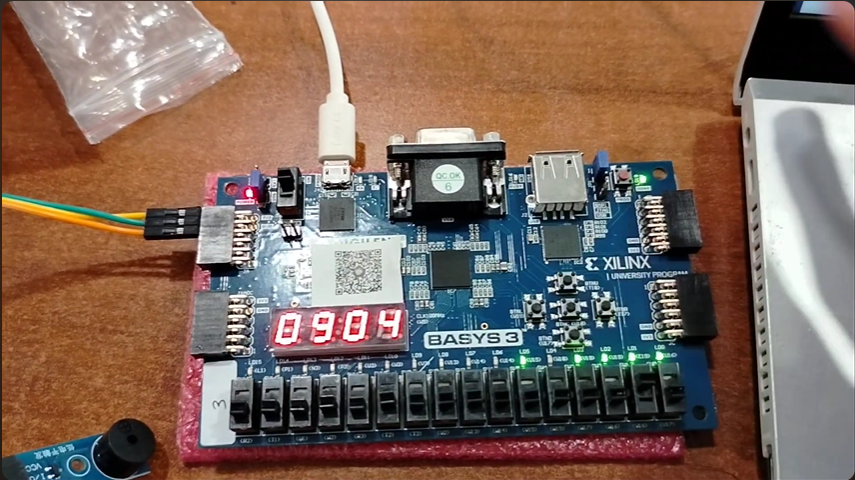
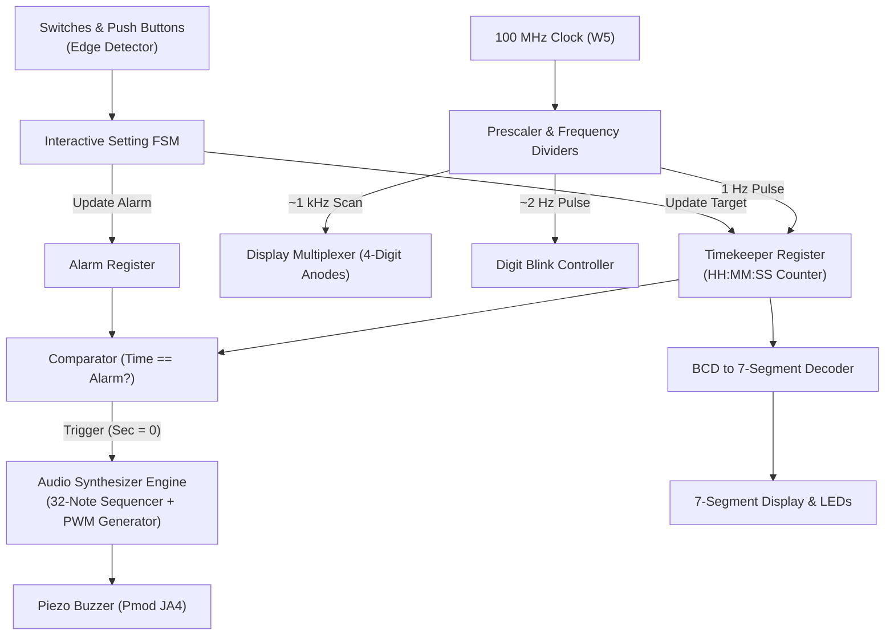
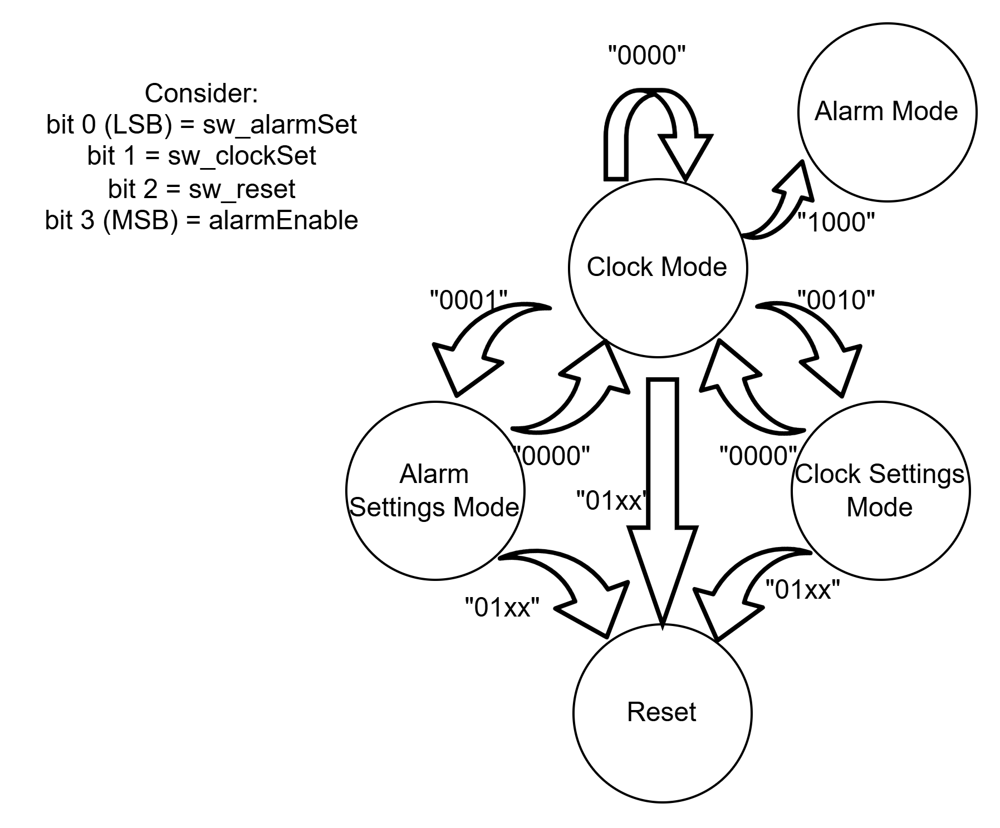
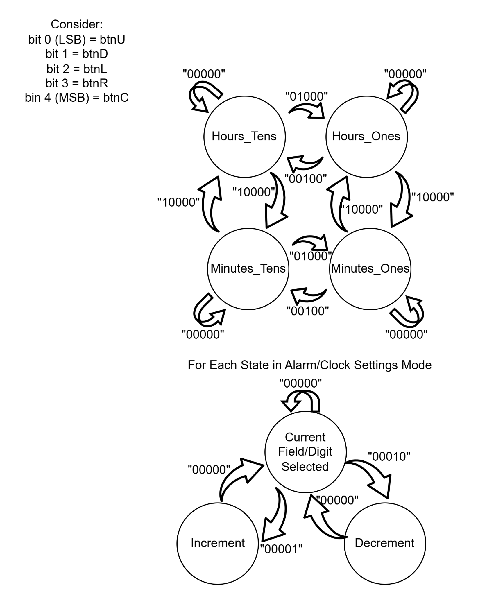
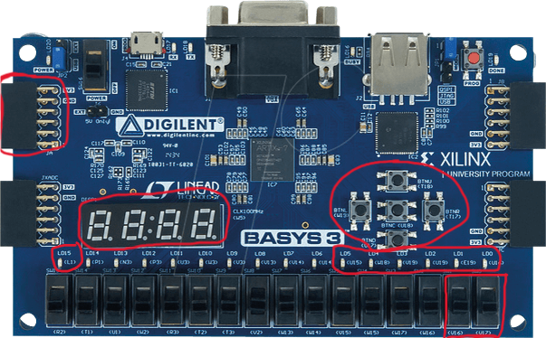
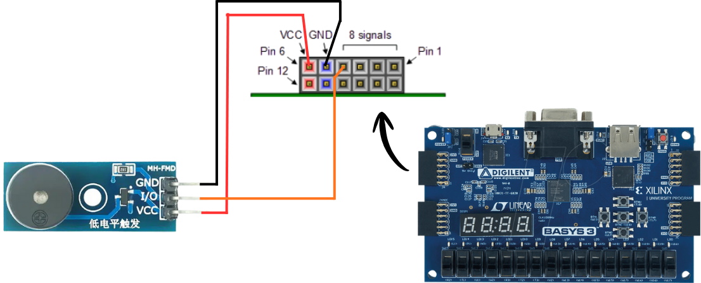
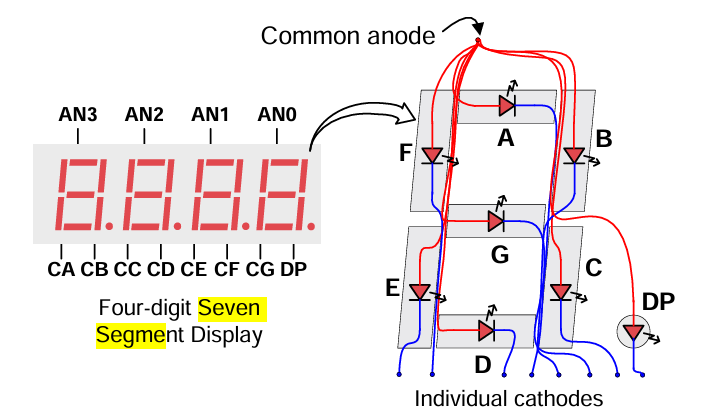
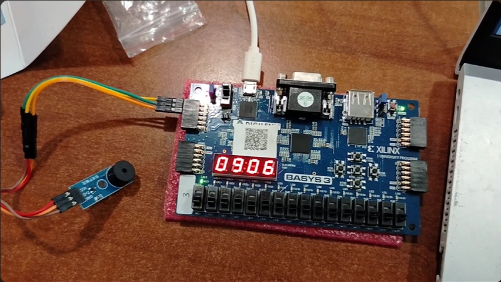

# ⏱️ 24-Hour Digital Clock & Musical Alarm on FPGA Digilent Basys 3

<p align="center">
  
</p>

<p align="center">
  
  
  
  
  
  
</p>

---

## 📌 Project Overview

This project presents a hardware-level **24-Hour Real-Time Digital Clock and Musical Alarm System** implemented in **VHDL** on the **Digilent Basys 3 FPGA Board (Xilinx Artix-7 `xc7a35tcpg236-1`)**. 

Unlike software-driven microcontroller designs, this implementation synthesizes dedicated sequential and combinatorial digital hardware logic. It features:
* **True Hardware Timekeeping**: Derives accurate 1-second ticks and ~1 kHz display refresh timebases directly from the 100 MHz onboard oscillator via high-speed counter chains.
* **4-Digit Time Multiplexing**: Drives a common-anode 7-segment display showing Hours ($HH$) and Minutes ($MM$) with persistence-of-vision multiplexing.
* **6-Bit Binary Seconds**: Employs onboard LEDs (`LD0`–`LD5`) to display the real-time second progression ($0$–$59$) in raw binary.
* **Interactive Setting FSM**: Supports independent adjustment of Hours and Minutes for both the real-time clock and the alarm target, complete with visual **2 Hz digit-blinking** to indicate the active selection.
* **Musical Tone Synthesizer**: Uses a square-wave frequency divider to drive an external passive piezo buzzer on **Pmod JA4**, playing a 32-note melody (*"Twinkle Twinkle Little Star"*) when the alarm triggers.

---

## 🏛️ System Architecture & Finite State Machines

The digital system is modeled around hierarchical **Finite State Machines (FSM)** and modular synchronous processes:



### 1. Global Operating Mode FSM
Transitions between **Normal Clock Mode**, **Clock Setting Mode**, **Alarm Setting Mode**, and **Global Reset** are determined by slide switches `V16`, `V17`, and `R2`:

<p align="center">
  
</p>

### 2. Interactive Digit Navigation FSM
During setting modes, push buttons allow bidirectional cursor traversal across Hours Tens, Hours Units, Minutes Tens, and Minutes Units:

<p align="center">
  
</p>

* **`btnC` (Center)**: Toggles active field between **Hours ($HH$)** and **Minutes ($MM$)**.
* **`btnL` (Left) / `btnR` (Right)**: Selects between **Tens Digit** and **Units Digit**.
* **`btnU` (Up) / `btnD` (Down)**: Increments or decrements the selected digit with automatic modulo wrap-around ($mod\ 24$ for hours, $mod\ 60$ for minutes).

---

## 🔌 Hardware Setup & Interfacing

<p align="center">
  
</p>

### Buzzer Interfacing (Pmod JA)

An external low-trigger passive piezo buzzer module (**MH-FMD**) is interfaced via the **Pmod JA** header:

<p align="center">
  
</p>

| Buzzer Module Pin | Pmod JA Pin | FPGA Pin | Signal / Description |
|:---|:---|:---|:---|
| **VCC** | Pin 6 | `3V3` | 3.3V DC operational power |
| **GND** | Pin 5 | `GND` | Common reference ground |
| **I/O** | Pin 4 | **`G2` (JA4)** | Square-wave PWM audio tone output (Active-Low) |

### Onboard I/O Pin Assignment

| Peripheral | Port Name | FPGA Pin | Direction | Description |
|:---|:---|:---|:---|:---|
| **System Clock** | `clock_100Mhz` | `W5` | Input | 100 MHz oscillator |
| **Reset Switch** | `reset` | `R2` | Input | Slide switch 15 (Active-High) |
| **Clock Set Switch** | `sw_clock` | `V16` | Input | Slide switch 1 |
| **Alarm Set Switch** | `sw_alarm` | `V17` | Input | Slide switch 0 |
| **Navigation Buttons** | `btnC`, `btnU`, `btnL`, `btnR`, `btnD` | `U18`, `T18`, `W19`, `T17`, `U17` | Input | Debounced push buttons |
| **7-Segment Anodes** | `Anode_Activate[3:0]` | `W4`, `V4`, `U4`, `U2` | Output | Active-Low digit strobes (AN3..AN0) |
| **7-Segment Cathodes** | `LED_out[6:0]` | `U7`, `V5`, `U5`, `V8`, `U8`, `W6`, `W7` | Output | Active-Low segment lines (CG..CA) |
| **Binary Seconds** | `led_sec[5:0]` | `U15`, `W18`, `V19`, `U19`, `E19`, `U16` | Output | Binary second display (LD5..LD0) |
| **Alarm Indicator** | `led_alarm_on` | `L1` | Output | Status LED (LD15) |
| **Audio Buzzer** | `buzzer` | `G2` | Output | Pmod JA4 audio output |

---

## 💡 Hardware Display & Multiplexing Architecture

The Basys 3 features a 4-digit common-anode seven-segment display where all four digits share common cathode lines ($CA$–$CG$):

<p align="center">
  
</p>

* **Persistence of Vision (PoV)**: A 20-bit counter (`refresh_counter`) scans through the digits at approximately **95.3 Hz per digit** (refreshing all four digits at ~380 Hz). This ensures zero perceptible flicker.
* **Active-Low Cathode Truth Table**:
  $$\text{LED\_out} = \{CA, CB, CC, CD, CE, CF, CG\}$$
  * `'0' \rightarrow \text{"1000000"}`
  * `'1' \rightarrow \text{"1111001"}`
  * `'2' \rightarrow \text{"0100100"}`
  * `'3' \rightarrow \text{"0110000"}`
  * `'4' \rightarrow \text{"0011001"}`
  * `'5' \rightarrow \text{"0010010"}`
  * `'6' \rightarrow \text{"0000010"}`
  * `'7' \rightarrow \text{"1111000"}`
  * `'8' \rightarrow \text{"0000000"}`
  * `'9' \rightarrow \text{"0010000"}`

---

## 🎵 Musical Alarm Synthesizer

When the real-time clock matches the alarm target ($HH_{clock} == HH_{alarm} \land MM_{clock} == MM_{alarm} \land SS == 0$), the alarm activates:
1. `led_alarm_on` (`LD15`) illuminates.
2. The 32-note melody sequencer begins playing *"Twinkle Twinkle Little Star"*:

<p align="center">
  
</p>

### Musical Note Frequency Synthesizer Table

$$f_{target} = \frac{f_{clk}}{2 \times \text{tone\_limit}} \implies \text{tone\_limit} = \frac{100{,}000{,}000}{2 \times f_{note}}$$

| Musical Note | Frequency ($Hz$) | Half-Period Cycles (`tone_limit`) | Note Duration |
|:---|:---|:---|:---|
| **C4** | 262 Hz | 190,839 cycles | 0.5 sec |
| **D4** | 294 Hz | 170,068 cycles | 0.5 sec |
| **E4** | 330 Hz | 151,515 cycles | 0.5 sec |
| **F4** | 349 Hz | 143,266 cycles | 0.5 sec |
| **G4** | 392 Hz | 127,551 cycles | 0.5 sec |
| **A4** | 440 Hz | 113,636 cycles | 0.5 sec |
| **Rest (0)** | 0 Hz | 0 (Silent pause) | 0.5 sec |

---

## 📂 Repository Structure

```text
fpga-digital-clock-alarm-basys3/
├── src/
│   └── digital_clock_setting.vhd       # Top-level RTL VHDL source code
├── constrs/
│   └── Basys3_Master.xdc              # Physical pin constraints for Xilinx Artix-7
├── sim/
│   └── digital_clock_setting_tb.vhd   # Comprehensive VHDL simulation testbench
├── assets/                            # Architecture diagrams, schematics, and demo photos
│   ├── demo_clock_running.png
│   ├── demo_alarm_triggered.png
│   ├── basys3_pinout_annotated.png
│   ├── hardware_wiring.png
│   ├── fsm_system_modes.png
│   ├── fsm_digit_settings.png
│   └── seven_segment_architecture.png
├── .gitignore                         # Vivado build artifacts & temporary files ignore rules
├── LICENSE                            # MIT Open Source License
└── README.md                          # Comprehensive project documentation
```

---

## 🛠️ Reproduction & Vivado Synthesis Guide

### 1. Create a New Vivado Project
1. Open **Xilinx Vivado Design Suite** (2020.1 or newer).
2. Click **Create Project** → **RTL Project**.
3. Select the target FPGA part:
   * **Part**: `xc7a35tcpg236-1`
   * *Or select the board preset*: **Digilent Basys 3**.

### 2. Import Source Files & Constraints
1. In the **Sources** pane, click **Add Sources** → **Add or create design sources** → select [`src/digital_clock_setting.vhd`](src/digital_clock_setting.vhd).
2. Click **Add Sources** → **Add or create constraints** → select [`constrs/Basys3_Master.xdc`](constrs/Basys3_Master.xdc).
3. Click **Add Sources** → **Add or create simulation sources** → select [`sim/digital_clock_setting_tb.vhd`](sim/digital_clock_setting_tb.vhd).

### 3. Run Synthesis & Implementation
1. Click **Run Synthesis** and verify that no critical warnings or syntax errors are reported.
2. Click **Run Implementation** to map, place, and route the logic cells onto the Artix-7 fabric.
3. Click **Generate Bitstream** to produce the configuration file (`.bit`).

### 4. Program the FPGA
1. Connect the Basys 3 board to your PC via Micro-USB and power on the switch (`POWER`).
2. Connect the passive buzzer module to **Pmod JA** (`Pin 4`, `Pin 5`, `Pin 6`).
3. Open **Hardware Manager** → **Auto Connect**.
4. Right-click `xc7a35t_0` → **Program Device** → select the generated `.bit` file.

---

## 👥 Authors & Contributors

* **Muhammad Raihan Aqeela Akbar**
* **Hayqal Husein Alhabsyi**
* **Muhammad Minanur Rohman**
* **Muhammad Zaki Firmansyah**
* **Rizky Mardhani**
* **Mochammad Salman Al Farizy**

---

## 📄 License

This project is licensed under the **MIT License** — see the [LICENSE](LICENSE) file for complete details.
